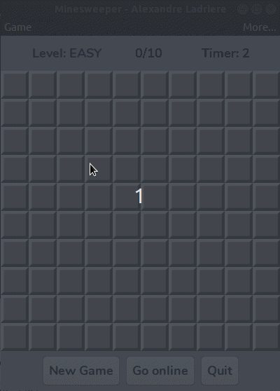
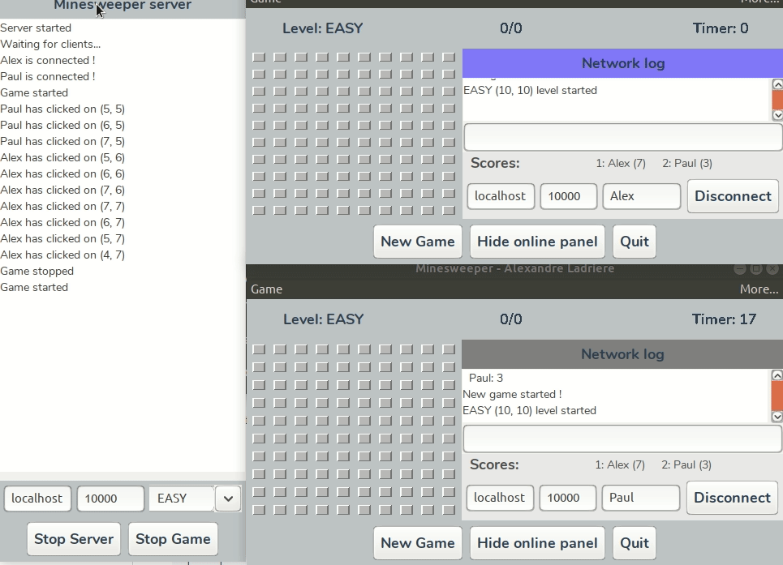
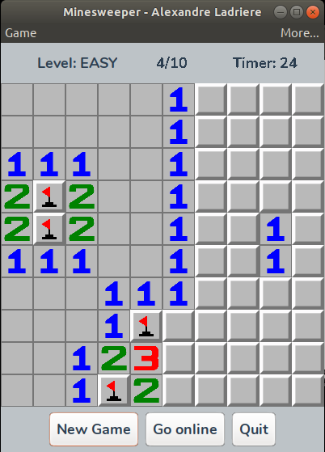
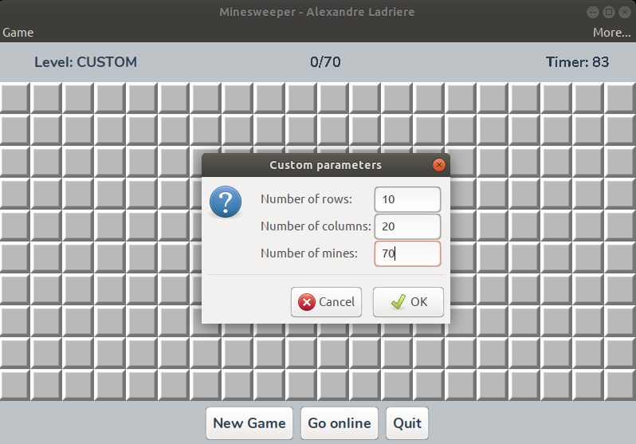
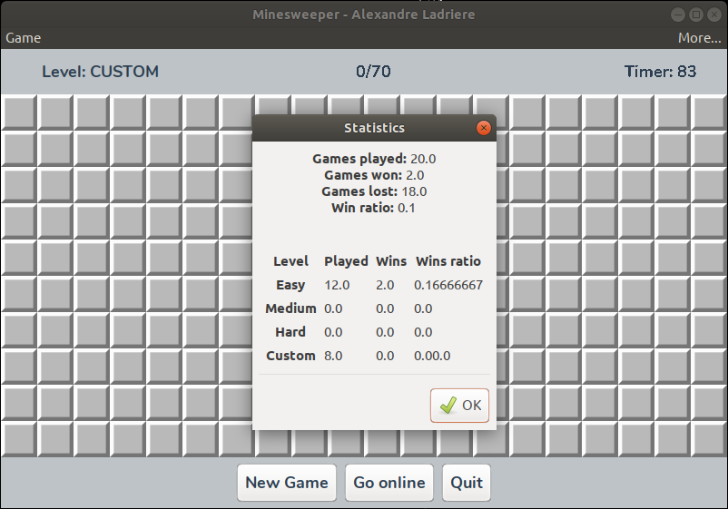
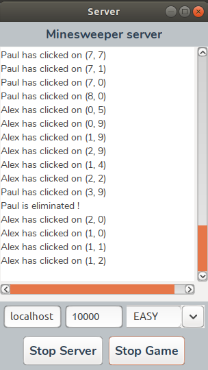
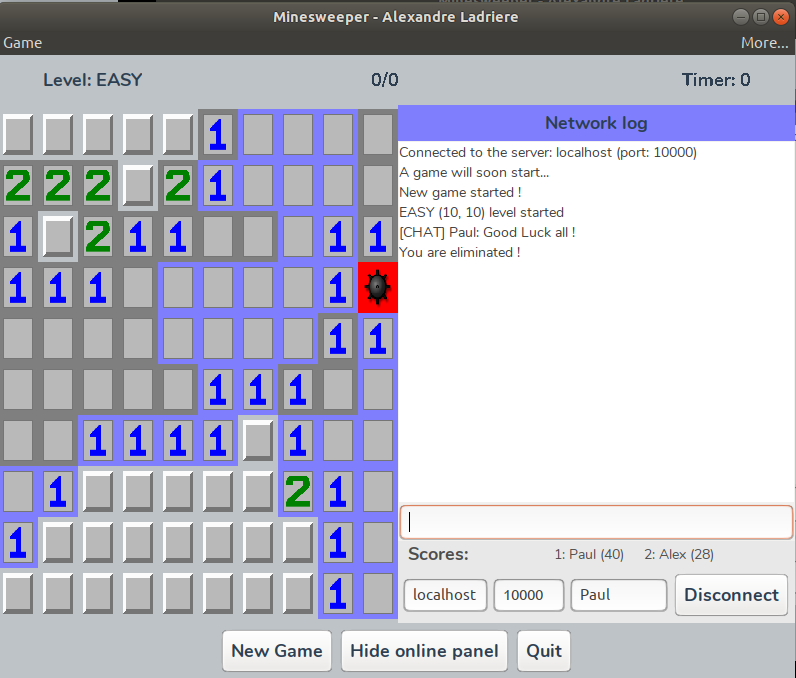

# Networkable Minesweeper

The __Networkable Minesweeper__ is a classic minesweeper game, developped in JAVA and playable both offline and in network.

## Dependencies

This app is using the _Nunito_ font, which you can download [here].

If you are a Linux user, you can simply install it by running the [fonts.install.sh] file:

```bash
sudo sh fonts.install.sh
```

However, it is not mandatory to install the _Nunito_ font.

## Installation & Run

First, you need to compile all the ```.java``` files. In order to do that, you can simply run the [compile.sh] file:
```bash
sh compile.sh
```

### Building JAR

The easiest way to test this app, is by using ```.jar``` files. In order to do that, you just have to run the [build_jar.sh] file:
```bash
sh build_jar.sh
```

This will create two ```.jar``` files at the root of the project folder: one for the client (i.e.: the solo part), called ```Client.jar```, and another one for the server, called ```Server.jar```. Then you just have to double-click on them if you want to run them.

### Running ```.class``` files
You can also run the app by directly running the ```.class``` files.
If you want to play solo, you just have to run the [client.run.sh] file:
```bash
sh client.run.sh
```

You can also run the server thanks to the [server.run.sh] file:
```bash
sh server.run.sh
```

## Testing server/client communication

If you want to test the client/server part of this app on your computer, you need to run at least a second client and the server.

When the server is running, you need to start it by clicking on the __Start Server__ button.

Then, to connect clients to the server, you just need to give a unique _player name_ to each client.

If you are testing only on your computer, you don't need to change the name of the server (```localhost```) or the port of the server (```10000```).

## Demos

### Solo
 

### Multiplayer
 

## Screenshots

 

 

 

 

 

## Structure

```
├── Javadoc
├── src
│    ├── ismin.minesweeper
│    │    ├── client
│    │    │    ├── Controller.java
│    │    │    ├── FlagCounter.java
│    │    │    ├── Gui.java
│    │    │    └── Minesweeper.java
│    │    ├── enums
│    │    │    ├── FileNames.java
│    │    │    ├── Level.java
│    │    │    └── ServerMessageTypes.java
│    │    ├── server
│    │    │    ├── EchoThread.java
│    │    │    ├── Server.java
│    │    │    ├── ServerController.java
│    │    │    └── ServerGui.java
│    │    ├── utils
│    │    │    ├── Case.java
│    │    │    ├── Counter.java
│    │    │    ├── CustomJOptionPane.java
│    │    │    └── Field.java
│    ├── fonts
│    │    └── Nunito.zip
│    ├── img
│    │    ├── 0.png
│    │    ├── 1.png
│    │    ├── 2.png
│    │    ├── 3.png
│    │    ├── 4.png
│    │    ├── 5.png
│    │    ├── 6.png
│    │    ├── 7.png
│    │    ├── 8.png
│    │    ├── bomb.png
│    │    ├── flag.png
│    │    ├── mine_icon.png
│    │    ├── restart_icon.png
│    │    └── tile.png
├── .gitignore
├── build_jar.sh
├── client.run.sh
├── compile.sh
├── fonts.install.sh
├── LICENSE
├── README.md
└── server.run.sh
```

## Developed with
  - Java 12.0.2 2019-07-16
  - Java(TM) SE Runtime Environment (build 12.0.2+10)
  - Java HotSpot(TM) 64-Bit Server VM (build 12.0.2+10, mixed mode, sharing)
  - Ubuntu 18.04.3 LTS

## License
This project is licensed under the MIT License - see the [LICENSE] for details

   [LICENSE]: <LICENSE>
   [compile.sh]: <compile.sh>
   [server.run.sh]: <server.run.sh>
   [client.run.sh]: <client.run.sh>
   [fonts.install.sh]: <fonts.install.sh>
   [build_jar.sh]: <build_jar.sh>
   [here]: <https://fonts.google.com/specimen/Nunito>